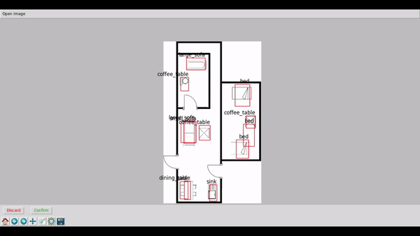

# TrainMe:

<h1>Annotation Tool for Training A Deep Neural Network Model for Floor Plan Image Analysis</h1>
 

<h3>REQUIREMENTS</h3> 
python matplotlib tkinter pandas

<h3>MOTIVATION</h3>

In one of my previous project i worked on object detection in floor plan images. Most laborious and time consuming task in this project was to create the annotation of images. We have to annotate each object in an image manually and store their coordinates and label in an xml file .we used some tools like "labelme" but on average you would have spend at least 2 minute per image for annotation and with this speed you would be able to annotate at best 30 images in an hour. now you can imagine how much tedious task it is. 
we developed a software to reduce the time and which makes the whole task much easier and efficient. 
we integrated the model we trained in the project https://github.com/dwnsingh/Object-Detection-in-Floor-Plan-Images with software which read an image and recognize the objects in the image. model may predict few objects wrongly and may not be able to predict the few objects at all it depends on the accuracy of your model. but with the software you can delete wrongly identify objects and correct them and also draw the unidentified objects as well. model will automatically generate the xml annotation file.

<h3>FEATURES</h3>

1. Import directory in which images are stored
2. Run the trained model on each images one by one and predict the objects in the image and display the image with predicted objects on the screen by drawing a bounding box around the objects 
3. Delete a bounding box if it is wrongly classified.
4. Modify label of bounding box if it is incorrectly recognized
5. Create bounding box around the objects which have not been recognized and assign a label to it
6. If an object is recognized more than once or having more than one bounding box we are able to select both the bounding box and delete the wrong one
7. Discard the image if it is not appropriate for object annotation at the time and next image would load from folder automatically and displayed with objects predicted on screen
8. Confirm the image if it is identifying objects correctly or after performing the modification by using the above operations.
9. Generate an xml file for the confirmed image which contains annotations of different objects present in the image and moves the image and generated file in another directory.

<h3>DEVELOPMENT</h3>

There are two files <i>soft.py</i> which contain methods and variables used in software and <i>show_predict_img.py</i> which contain the model which we are using. 
To develop basic GUI we used python and Tkinter library and Matplotlib 
The opening frame has a key to import the directory in which images are stored. 
Once the directory is imported we connect training model to software and images are processed one by one by training model to predict objects in the image. Training model returns the image and list of generated object annotation. 
This list of the annotation is stored in a CSV file. Then with the help of pandas library is being read to create a Dataframe. 
The Image returned by the model is displayed on the opening frame in the form of a plot using Matplotlib. Data stored in Dataframe is used to draw bounding boxes around the objects with the help of Matplotlib. 
Animation function is implemented which is called again and again to detect any change in Dataframe so that same can be reflected in the plot. 
On click inside any bounding box, a pop up is generated which gives option to delete the box or edit the label on the box and save. Changes are saved in Dataframe and because animation function is reading Dataframe continuously changes are reflected on the plot. 
On click callback function is used to detect the coordinates of click and check whether the clicked coordinates lie inside of any bounding box or not if they don't then no pop up is generated. 
Similarly, another callback function is used to create bounding box on the plot if any object is not recognized and a popup is generated to store the label of newly created box and changes are saved in Dataframe and hence reflected on the plot. 
The opening frame has two more options which are ‘Discard’ and ‘Confirm’ image.
On ‘Discard’ the CSV file created for the image is deleted and the image moved to another folder named ‘Discard’.  
On  ‘Confirm’ the CSV file is used to generate an XML file for the corresponding image and XML file along with the image is moved to another directory named ‘Confirm’ and CSV file is removed because it is of no use after this. 
After  Discard or Confirm of an image a new from the imported directory is passed to model and model predict the results and results are displayed on opening frame and same and same functionalities are followed again. 

<b>ILLUSTRATION</b>

